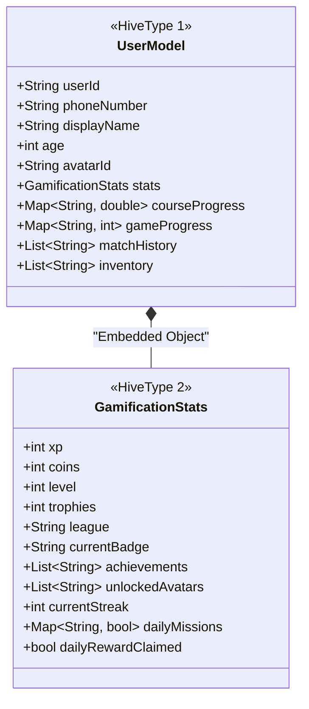

# 07 - Database Design and Data Models

The following represents the true data architecture used within Lerno. Unlike traditional relational applications, Lerno relies heavily on NoSQL document paradigms using **Hive** for high-speed local data persistence, synchronized with remote backend services (e.g., Firebase).

## 📊 Core Data Architecture (NoSQL/Hive)

## 🗄 Core Domain Entities

### 1. Gamification Models
- **League**: Tiers of competition.
  - `id` (String), `name` (String), `minTrophies` (int), `iconUrl` (String).
- **Task**: Daily missions and objectives.
  - `id` (String), `title` (String), `description` (String), `targetValue` (int), `xpReward` (int), `coinReward` (int), `taskType` (String).
- **Badge**: Unlocked achievements.
  - `id` (String), `name` (String), `description` (String), `imageUrl` (String), `unlockedAt` (DateTime).

### 2. Learning Path Models
- **Subject**: High level category (e.g., Math, Reading).
  - `id` (String), `name` (String), `description` (String), `icon` (IconData), `courseCount` (int).
- **Course**: A specific curriculum unit.
  - `id` (String), `subjectId` (String), `title` (String), `difficulty` (String), `topicCount` (int).
- **Topic**: Groupings within a course.
  - `id` (String), `courseId` (String), `title` (String), `orderIndex` (int).
- **Lesson**: Individual learning module.
  - `id` (String), `topicId` (String), `title` (String), `content` (String), `xpReward` (int).
- **QuizQuestion**: Evaluative challenge.
  - `id` (String), `questionText` (String), `options` (List~String~), `correctOptionIndex` (int).

### 3. Store and Avatar Models
- **AvatarModel**: Cosmetic items in the shop.
  - `avatarId` (String), `displayName` (String), `rarity` (String), `coinCost` (int), `achievementRequirement` (String).

## 🗃 Normalization & Storage Strategy
- **Nested Documents**: Because read speeds are critical for rendering the UI (e.g., checking XP, coins, and levels on the dashboard), the `GamificationStats` object is heavily denormalized and stored directly inside the `UserModel` Hive box.
- **Maps for Progress**: Instead of a relational cross-reference table for user progress, the `UserModel` utilizes Maps (`courseProgress`, `gameProgress`) to track completion states instantly on the device.
- **Local-First Synchronization**: The app initializes by loading from the local Hive boxes, then runs background tasks via repository implementations to synchronize states to the remote servers.
