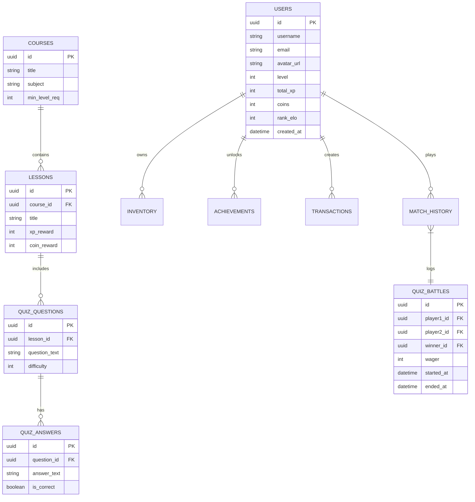

# 07 - Database Design

The following represents the production relational database design required to support the application.

## 📊 Complete ER Diagram

## 🗄 Core Tables

### Users Table
Core user identity and gamification state.
- **Indexes**: Indexed by `username` for search, and `total_xp` / `rank_elo` for fast leaderboard generation.

### Courses & Lessons Tables
Hierarchical structure for the Learning Path.
- normalized to allow dynamic addition of subjects without altering schema.

### Quiz Questions & Answers Tables
Bank of questions for both solo learning and multiplayer battles.
- `difficulty` determines how much XP/ELO a question is worth in ranked mode.

### Quiz Battles Table
Stores historical data of 1v1 interactions. Used for anti-cheat analysis and user statistics generation.

## 🗃 Normalization Strategy
The database is generally in 3NF. However, fields like `total_xp` and `coins` are heavily denormalized and stored directly on the `Users` table (rather than summing up all `Transactions`) because they are read on almost every API call and UI render. 
