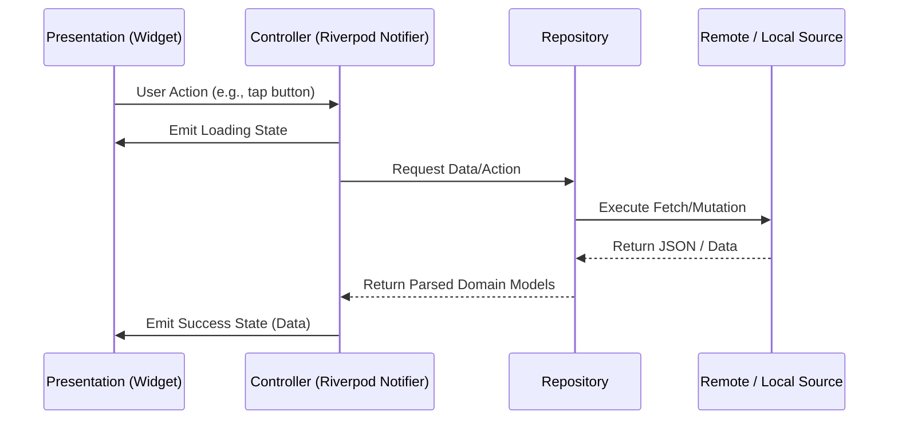

> [!NOTE]
> **CURRENT PROTOTYPE**: This document describes the current active development state, utilizing mock data and local persistence.

# Project Architecture

## 🏛 Complete Architecture Overview

Lerno utilizes a robust, scalable architecture tailored for large Flutter applications. It relies heavily on **Feature-First Folder Structure** combined with **Clean Architecture** principles and **Riverpod** for declarative state management.

## 🧩 Feature-First Architecture

Unlike traditional layer-first architectures (grouping all models, then all views, etc.), Lerno organizes code by **features**. Every domain feature (e.g., `auth`, `games`, `profile`) is a self-contained module containing its own presentation, domain, and data layers. This ensures deep decoupling and allows different developers to work on features concurrently without merge conflicts.

```text
lib/
└── features/
    └── {feature_name}/
        ├── presentation/     # UI, Widgets, Riverpod Controllers
        ├── domain/           # Entities, Enums, Business Logic
        └── data/             # Repositories, DTOs, API Services
```

## 🧹 Clean Architecture Integration

Inside each feature, Clean Architecture principles are strictly applied:

1. **Presentation Layer**: 
   - Purely responsible for rendering UI based on State.
   - Communicates with business logic strictly through Riverpod `StateNotifier` or `Notifier` providers.
2. **Domain/Business Logic Layer**: 
   - Handles the core business rules. 
   - Consists of Riverpod Controllers that manipulate data and emit new states.
3. **Data Layer**: 
   - Communicates with external sources (APIs, Local DB).
   - Exposes **Repositories** defined by abstract interfaces, allowing seamless swapping between Mock and Production implementations.

## 💧 Riverpod Architecture

[Riverpod](https://riverpod.dev/) is the backbone of Lerno's reactivity.
- **Global Dependencies**: Services like networking and secure storage are provided globally via simple `Provider`.
- **State Providers**: Features use `AsyncNotifierProvider` to elegantly handle Loading, Data, and Error states in the UI.
- **Dependency Injection**: Repositories are injected into Controllers, making the system highly testable.

## 🔄 Repository Pattern & Service Layer

- **Repositories**: Act as the single source of truth for a feature's data. They abstract whether data comes from a local cache or a remote API.
- **Service Layer**: Pure, stateless classes responsible for executing specific tasks (e.g., `AuthService`, `AudioService`, `AnalyticsService`).

## 📊 Data Flow



## 🏗 High-Level System Architecture Diagram

```mermaid
graph TD
    UI[Flutter UI Layer] -->|Reads State & Sends Events| RM[Riverpod State Management]
    RM -->|Calls Methods| Repos[Repository Layer]
    
    Repos -->|Reads/Writes| LocalCache[(Local SQLite/Prefs)]
    Repos -->|REST/WebSockets| RemoteAPI[FastAPI Backend]
    
    subgraph Core Services
        AuthService
        AudioService
        SecurityService
    end
    
    Repos -.-> Core Services
```
