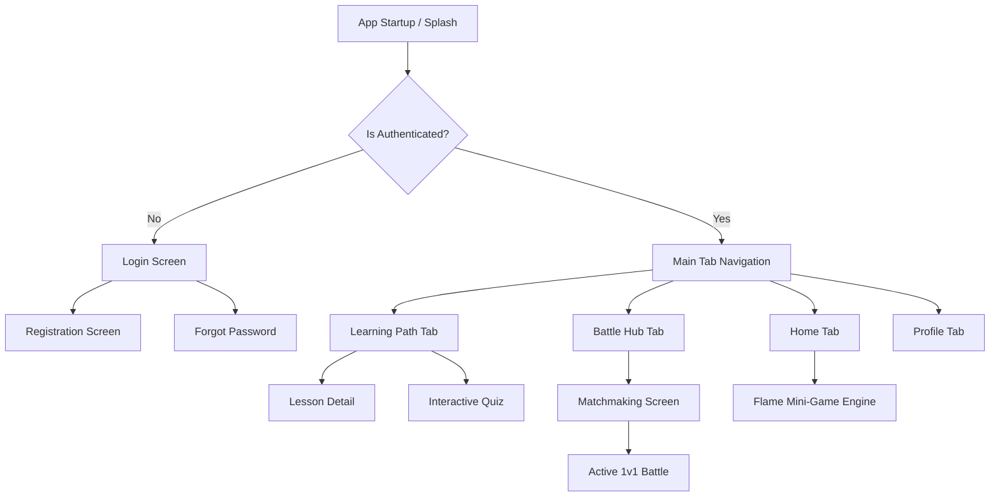

> [!NOTE]
> **CURRENT PROTOTYPE**: This document describes the current active development state, utilizing mock data and local persistence.

# Navigation Flow

The app uses `go_router` for a declarative, URL-based routing system. This allows deep linking and robust web support.

## 🗺 Route Hierarchy

## 🛡 Protected Routes

Routing is heavily guarded via a `redirect` handler in the GoRouter configuration.
- The router listens to the `AuthNotifier`.
- If a user tries to access `/home` but the state is `Unauthenticated`, GoRouter instantly redirects them to `/login`.
- If a user is on `/login` and the state becomes `Authenticated`, they are redirected to `/home`.

## 📍 Bottom Navigation

The primary interface relies on a customized `ScaffoldWithNavBar` (or `StatefulShellRoute`).
This preserves the state of individual tabs. For example, scrolling down the Learning Path, switching to the Profile tab, and switching back will not reset the Learning Path's scroll position.
