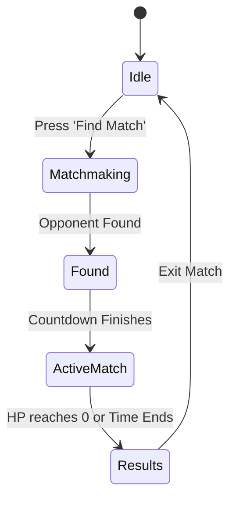

> [!NOTE]
> **CURRENT PROTOTYPE**: This document describes the current active development state, utilizing mock data and local persistence.

# Quiz Battle System

## ⚔️ Overview

The Quiz Battle system is Lerno's primary multiplayer mechanic, designed to drive engagement through healthy competition.

## 🔄 Battle Flow

## 🆚 Match Types

1. **Casual Battles**: No ELO risk. Friendly matches for practice or against direct friends.
2. **Ranked Battles**: Uses an ELO-based matchmaking system. Winning increases rank; losing decreases it.
3. **Bot Battles**: If matchmaking takes longer than 15 seconds, a simulated AI bot is smoothly introduced to ensure the user isn't kept waiting. Bots simulate human typing speeds and error rates.

## 🏆 League System

Players are grouped into weekly Leagues (e.g., Bronze, Silver, Gold).
- Earning trophies in Ranked Battles moves players up the leaderboard.
- At the end of the week, the top 20% are promoted, and the bottom 20% are demoted.

## 🧮 Reward Calculation

Victory yields higher rewards, but losing still provides minor compensation to avoid frustrating younger users.
- **Win**: +30 Trophies, +50 Coins, +100 XP.
- **Loss**: -15 Trophies, +10 Coins, +20 XP.
- *Win streaks multiply coin and XP rewards.*
