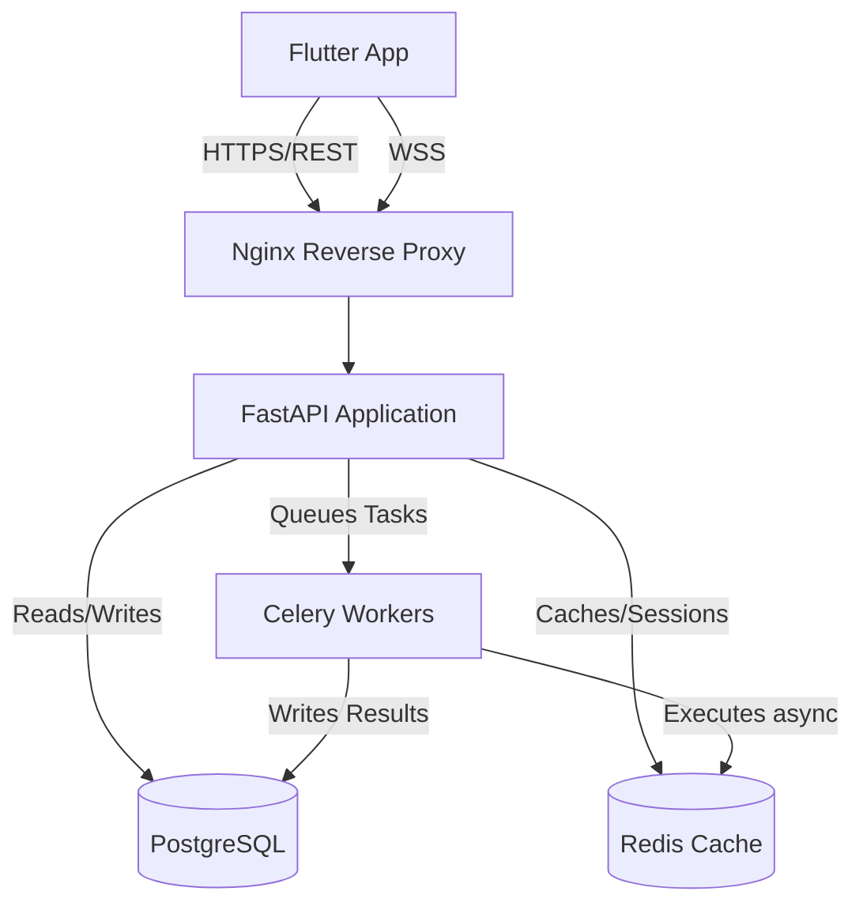

> [!IMPORTANT]
> **PRODUCTION BLUEPRINT**: This document describes the final target architecture and APIs. It does not reflect the current mock-data prototype.

# Backend Architecture

## 🏛 Vision

The Lerno backend is an independent, production-grade system isolated from the Flutter client. It is responsible for providing secure, scalable APIs to support the gamified learning experience, including user profiles, course progression, virtual economies, and 1v1 quiz battles.

## 🛠 Technology Stack

To ensure high performance, type safety, and modern engineering practices, the backend utilizes the following stack:

- **Framework**: [FastAPI](https://fastapi.tiangolo.com/) (Python 3.13)
- **Package Manager**: [uv](https://github.com/astral-sh/uv) for extremely fast dependency management.
- **Database**: PostgreSQL
- **ORM**: SQLAlchemy 2.0 with asynchronous database drivers (`asyncpg`).
- **Migrations**: Alembic
- **Validation & Serialization**: Pydantic v2
- **Caching & Broker**: Redis
- **Background Jobs**: Celery
- **Object Storage**: Supabase Storage (with a migration path to AWS S3)
- **WebSockets**: Native FastAPI WebSockets for real-time quiz battles and chat.

## 📐 Architectural Principles

1. **API First & Self-Documenting**: By leveraging FastAPI and Pydantic, the backend automatically generates OpenAPI (Swagger/ReDoc) documentation. The Flutter client will eventually consume these contracts.
2. **Asynchronous by Default**: All I/O operations (database queries, external API calls) must be asynchronous to handle high concurrency, especially during real-time multiplayer battles.
3. **Repository Pattern**: Following the same pattern used in the Flutter frontend, data access logic is abstracted into repositories. This isolates the ORM (SQLAlchemy) from the business logic (Services) and the routing logic (FastAPI endpoints).
4. **Decoupled Monolith**: The backend is structured as a monolith but is highly modularized by feature (e.g., `auth/`, `users/`, `courses/`, `battles/`).

## 📊 High-Level Data Flow

