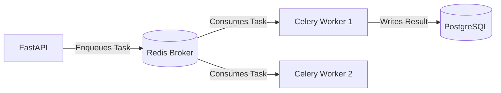

> [!IMPORTANT]
> **PRODUCTION BLUEPRINT**: This document describes the final target architecture and APIs. It does not reflect the current mock-data prototype.

# Background Jobs (Celery)

## ⏱ Purpose

FastAPI is incredibly fast for HTTP requests, but it should not be blocked by long-running, CPU-intensive, or external-network-dependent tasks. For these, we use **Celery** with a **Redis** message broker.

## 🚀 Use Cases in Lerno

1. **Email Sending**: Welcome emails, password reset links, and weekly progress reports.
2. **Push Notifications**: Broadcasting mass notifications to mobile devices (e.g., "A new League has started!").
3. **League Calculations**: Calculating weekly promotions, demotions, and rewards for the Leaderboard.
4. **Data Analytics**: Aggregating daily battle statistics for global rankings.
5. **Matchmaking Timeouts**: Cleaning up abandoned 1v1 battle queues.

## 🏗 Architecture



## 💻 Example Implementation

**worker.py (Celery Setup)**
```python
from celery import Celery

celery_app = Celery(
    "worker",
    broker="redis://localhost:6379/0",
    backend="redis://localhost:6379/0"
)

@celery_app.task
def send_welcome_email(user_email: str):
    # Simulate email sending
    import time
    time.sleep(2)
    print(f"Sent welcome email to {user_email}")
    return True
```

**api/v1/auth.py (FastAPI Endpoint)**
```python
from app.workers.worker import send_welcome_email

@router.post("/register")
async def register_user(request: RegisterRequest, db: AsyncSession = Depends(get_db)):
    # ... Create user in DB ...
    
    # Fire and forget the background job
    send_welcome_email.delay(request.email)
    
    return {"message": "Registration successful"}
```

## ⏳ Scheduled Tasks (Celery Beat)

For recurring jobs like Weekly League resets, we utilize **Celery Beat**, which schedules tasks using cron-like syntax.
