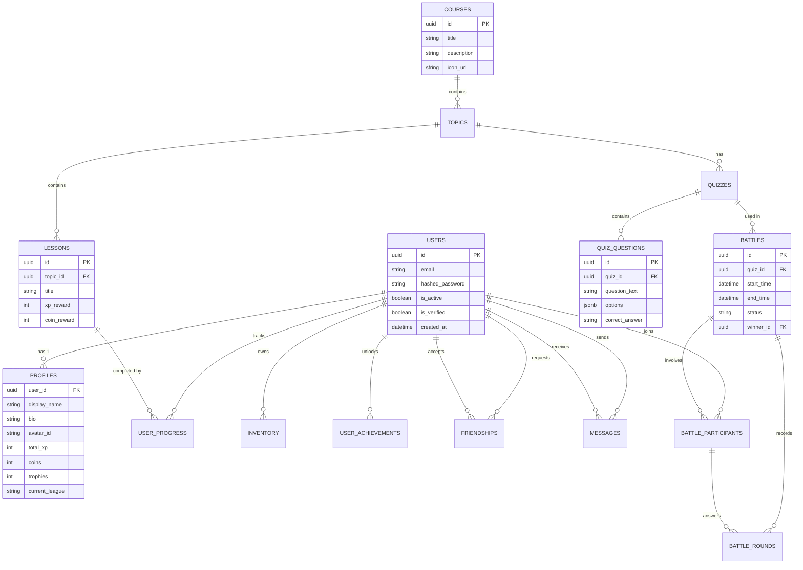

> [!IMPORTANT]
> **PRODUCTION BLUEPRINT**: This document describes the final target architecture and APIs. It does not reflect the current mock-data prototype.

# Entity Relationship (ER) Diagram

This diagram maps the core relational architecture of the Lerno database.

