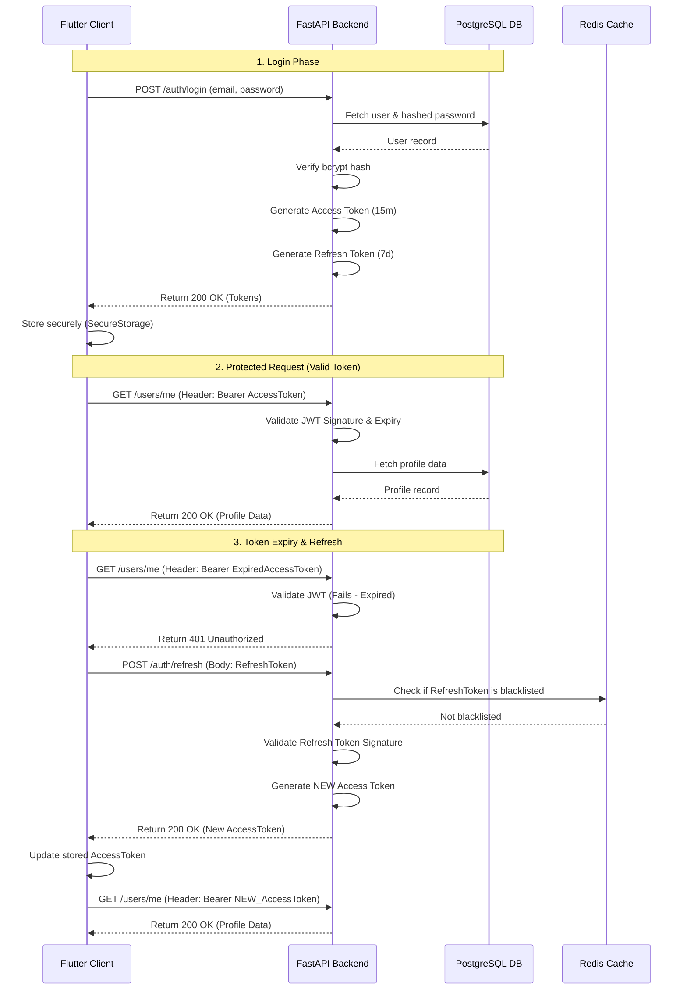

> [!IMPORTANT]
> **PRODUCTION BLUEPRINT**: This document describes the final target architecture and APIs. It does not reflect the current mock-data prototype.

# JWT Authentication Flow

This sequence diagram illustrates the stateless JWT flow between the Flutter Client, the FastAPI Backend, and the PostgreSQL database.

